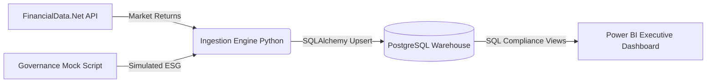

# Automated Financial Governance & Performance Platform

An end-to-end, production-grade Management Information System (MIS) designed to simulate an enterprise risk environment. This platform extracts live market data, synthesizes corporate ESG (Environmental, Social, and Governance) compliance metrics, and automatically audits assets against strict risk tolerances utilizing a robust SQL warehouse.

It demonstrates advanced Data Engineering and Data Analytics competence utilizing a 100% open-source backend stack, culminating in a dynamic executive Power BI Risk Dashboard.

---

## 🛠️ The Tech Stack

* **Language & Orchestration:** Python 3.x (`requests`, `pandas`, `sqlalchemy`)
* **Storage & Processing Layer:** PostgreSQL (Data Warehousing, Views, Window Functions)
* **Business Intelligence / BI:** Power BI Desktop / Tableau
* **Automation:** Windows Batch / Scheduled Cron Jobs

---

## 🏗️ Architectural Layout

This project operates on an automated "End-of-Day Batch Audit" logic:



### Phase 1: The Data Engineering Foundation
1. **API Ingestion Pipeline:** Python connects to the FinancialData.net REST API to extract stock lists and historical daily pricing metrics for a fixed watchlist (`AAPL`, `MSFT`, `NVDA`, `GOOG`, `AMZN`). Rate limits and pagination constraints are bypassed algorithmically.
2. **ESG Risk Simulation:** Because enterprise governance data often sits behind heavy paywalls, the pipeline incorporates an independent `mock_governance` simulation module. It programmatically issues daily ESG Ratings (1-100) assigning operational risk tiers.
3. **Relational Database Governance:** The data is pushed dynamically into a local PostgreSQL instance leveraging `psycopg2`. The schema ensures immaculate data hygiene via strictly typed numeric values, `created_at` pipeline tracking metadata, and robust composite Primary/Foreign key constraints across Dimension and Fact tables.

### Phase 2: Analytics & Business Intelligence Layer
1. **Automated Audit Logic (SQL Views):** All mathematical compliance testing is offloaded from BI directly into the database. A specialized view utilizes SQL window functions to calculate the 30-day Rolling Standard Deviation (volatility) of market prices.
2. **Exception Reporting System:** A distinct `vw_grc_exception_report` flags any asset exhibiting high price volatility swings combined with a degraded corporate ESG score. This pushes a hard `1` to the `is_compliance_violation` column.
3. **Power BI Dashboard:** A connected Power BI layout translates the SQL views into a clear executive visual, identifying real-time compliance failures through bold conditional formatting.

---

## 🚀 Local Setup & Installation

### 1. Prerequisites
- **Python 3.x** installed.
- **PostgreSQL** installed locally.
- **Power BI Desktop** installed locally.

### 2. Environment Variables
Clone the repository and create `.env` in the root folder containing your connection strings:
```ini
DB_USER=postgres
DB_PASS=your_password
DB_HOST=localhost
DB_PORT=5432
DB_NAME=financial_governance_db

API_KEY=your_financial_data_api_key
API_BASE_URL=https://financialdata.net/api/v1
```

### 3. Pipeline Execution
Simply double-click `run_pipeline.bat` (or manually run `python src/ingestion_engine.py`). 
The script will immediately:
- Install remaining packages from `requirements.txt`.
- Auto-generate the correct Postgres Data Warehouse dynamically if it does not exist.
- Loop and pull data from endpoints, bypassing pagination and `HTTP 429` constraints.
- Seed the local database with up to a year of historical performance.

### 4. BI Rendering
Open Power BI Desktop, navigate to **Get Data -> PostgreSQL Database**, and import the `vw_grc_exception_report`. Apply your visualization logic directly on top of the automated insights.

---

## 📋 Professional Outcomes
Executing this infrastructure highlights:
* **Relational Database Governance:** Enforcing automated data quality tracking, index optimization, and strict foreign-key dependencies.
* **Automated Risk Modeling & Audit Controls:** Utilizing SQL views to algorithmically verify raw price pipelines against dynamic enterprise tolerances.
* **End-to-End System Integration:** Replacing manual spreadsheet processing floors with programmatically insulated API pipelines and interactive dashboards for non-technical stakeholders.
